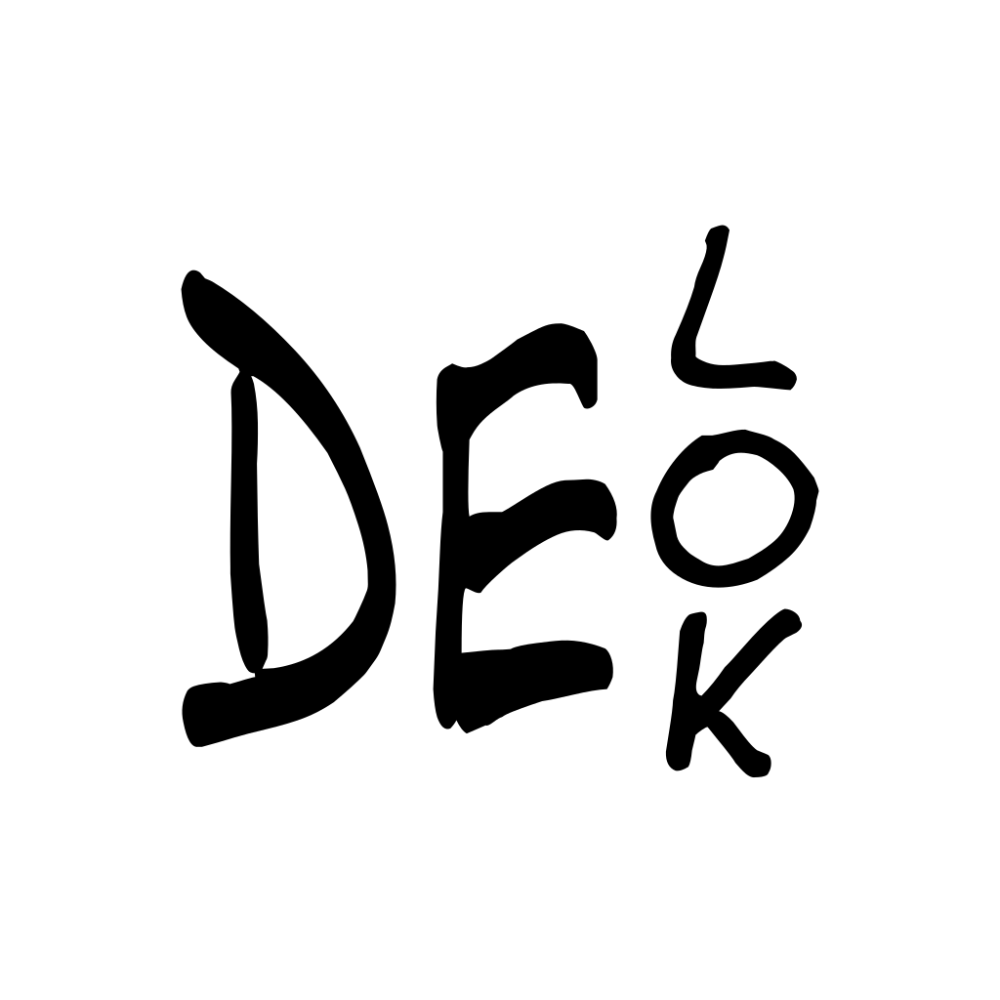

# DELOK

<div align="center">
  

  <strong>Decentralized Certificate Verification Platform</strong>

  <span>A blockchain-based certification system that connects Learning Management Systems (LMS) with verifiable NFT certificates through oracle integration</span>
</div>

## Overview

DELOK is a comprehensive dApp that bridges traditional Learning Management Systems with blockchain technology. It enables students to obtain verifiable NFT certificates for completed courses, with grades and certificates stored on IPFS and validated through smart contracts.

### Key Features

- 🎓 **LMS Integration**: Connect with existing learning platforms like Elemes
- 🔐 **SIWE Authentication**: Sign-In with Ethereum for secure wallet-based login
- 📜 **NFT Certificates**: Mint verifiable certificates as ERC-721 tokens
- 🌐 **IPFS Storage**: Decentralized storage for certificates and metadata
- 🤖 **Oracle System**: Automated verification and certificate issuance
- ⚡ **Local Development**: Complete local blockchain environment

## 🚀 Quick Start

### Prerequisites

- Node.js 18+
- Docker & Docker Compose
- MetaMask browser extension

### 1. Clone and Setup

```bash
git clone <repository-url>
cd delok
npm install
```

### 2. Environment Configuration

Create `.env` file:

```bash
# Blockchain Network
NODE_RPC_URL=http://localhost:8545
VITE_NODE_RPC_URL=http://localhost:8545
VITE_NODE_RPC_URL_CLIENT=http://localhost:8545

# LMS Integration
ELEMES_URL_DOCKER=http://elemes:3000
VITE_ELEMES_URL=http://localhost:3001

# IPFS Storage
KUBO_RPC_DOCKER=http://kubo:5001
```

### 3. Start Development Environment

```bash
# Start all services
docker-compose up -d

# Deploy smart contracts
cd _hardhat
npm run deploy:local

# Start oracle service
cd ../_oracle
npm run dev

# Start web application
npm run dev
```

### 4. Access the Application

- **Web App**: http://localhost:5173
- **LMS (Elemes)**: http://localhost:3001
- **IPFS Gateway**: http://localhost:8080

## 🐳 Production Deployment

### Docker Compose Services

```yaml
services:
  - hardhat: Local blockchain network
  - kubo: IPFS node for decentralized storage
  - elemes: Sample LMS integration
  - oracle: Smart contract event listener and processor
```

### Deployment Steps

1. Configure production environment variables
2. Deploy smart contracts to target network
3. Update contract addresses in configuration
4. Start services with production compose file

## 🛠️ Development

### Project Structure

```
delok/
├── app/                    # React frontend application
│   ├── routes/            # Page components and routing
│   ├── components/        # Reusable UI components
│   ├── lib/              # Utility libraries
│   └── wagmi-config.ts   # Blockchain client configuration
├── _hardhat/             # Smart contract development
│   ├── contracts/        # Solidity smart contracts
│   ├── ignition/         # Deployment scripts
│   └── hardhat.config.ts # Hardhat configuration
├── _oracle/              # Oracle service
│   ├── oracle.ts         # Event listener and processor
│   ├── utils-cert.ts     # Certificate handling utilities
│   └── utils-register.ts # Registration utilities
└── docker-compose.yml   # Development environment
```

### Smart Contracts

#### LMS_Elemes Contract
- **Address**: `0x5FbDB2315678afecb367f032d93F642f64180aa3`
- **Purpose**: Manages user registration and LMS ID mapping
- **Key Functions**:
  - `register(bytes32 _lmsid)`: Request registration with LMS ID
  - `assignLMSid(address _user, bytes32 _lmsid)`: Oracle assigns verified LMS ID
  - `IsRegistered(address _user)`: Check if user is registered
  - `getLMSid(address _user)`: Get user's LMS ID

#### DelokCertificate Contract
- **Address**: `0x9fE46736679d2D9a65F0992F2272dE9f3c7fa6e0`
- **Purpose**: ERC-721 NFT contract for certificates
- **Key Functions**:
  - `requestMintCertificate_Elemes(uint256 courseId)`: Request certificate for course
  - `mintCertificate_Elemes(string _tokenURI, address _to, uint256 courseId)`: Mint certificate (oracle only)
  - `tokenURI(uint256 tokenId)`: Get certificate metadata URI

### Oracle System

The oracle service monitors blockchain events and processes:

1. **Registration Flow**:
   - Listens for `RegistrationRequested` events
   - Verifies user credentials with LMS
   - Calls `assignLMSid` if verification succeeds

2. **Certification Flow**:
   - Listens for `MintRequested_Elemes` events
   - Fetches user grades from LMS
   - Generates PDF certificate
   - Uploads certificate and metadata to IPFS
   - Mints NFT with IPFS URI

### Frontend Features

- **SIWE Authentication**: Secure wallet-based login
- **LMS Integration**: Browse available courses
- **Certificate Management**: Request and view certificates
- **Token URI Lookup**: View certificate metadata
- **Responsive Design**: Mobile-friendly interface

### Development Commands

```bash
# Frontend development
npm run dev              # Start development server
npm run build           # Build for production
npm run preview         # Preview production build

# Smart contract development
cd _hardhat
npm run compile         # Compile contracts
npm run deploy:local    # Deploy to local network
npm run test           # Run contract tests

# Oracle service
cd _oracle
npm run dev            # Start oracle in development mode
npm run build          # Build oracle service
```

## 📦 Tech Stack

### Frontend
- **React 18**: Modern React with hooks
- **React Router v7**: Client-side routing
- **Mantine**: UI component library
- **TanStack Query**: Server state management
- **wagmi**: Ethereum interaction hooks
- **viem**: TypeScript Ethereum library

### Blockchain
- **Hardhat**: Development environment
- **Solidity 0.8.22**: Smart contract language
- **OpenZeppelin**: Security-audited contract libraries
- **UUPS Proxy**: Upgradeable contract pattern

### Backend & Infrastructure
- **Node.js**: JavaScript runtime
- **IPFS (Kubo)**: Decentralized file storage
- **Docker**: Containerization
- **TypeScript**: Type-safe development

### LMS Integration
- **Elemes**: Sample LMS for demonstration
- **Oracle Service**: Bridges LMS and blockchain
- **PDF Generation**: Dynamic certificate creation

## 📝 License

This project is open-sourced software licensed under the [MIT License](./LICENSE).

## 🙏 Acknowledgments

- **OpenZeppelin**: For battle-tested smart contract libraries
- **wagmi Team**: For excellent Ethereum React hooks
- **Hardhat**: For the comprehensive development environment
- **IPFS**: For decentralized storage infrastructure
- **Mantine**: For the beautiful UI component library